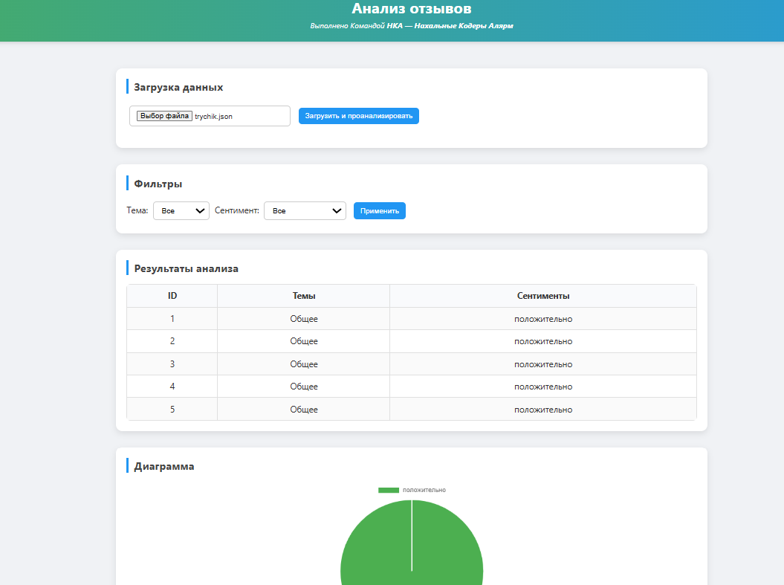

# Анализ отзывов

## 🚀 Функционал

- **REST API** для получения данных отзывов
- **Интерактивные графики** (круговая диаграмма для настроений, столбчатая для тем)
- **Динамические фильтры** по настроениям и темам
- **Адаптивный дизайн** с Bootstrap
- **Поддержка .env конфигурации**

##  Визуал



## 📦 Установка и запуск

1. **Клонируйте репозиторий** (или используйте существующую папку)

2. **Установите зависимости:**
```bash
pip install -r requirements.txt
```

3. **Запустите приложение локально:**
```bash
python -m uvicorn main:app --reload
```

## 🔌 API

### POST /api/put-data

Отправляет данные для анализа в формате:

```json
{
  "predictions": [
    {
      "id": 1, 
      "topics": ["Обслуживание", "Мобильное приложение"], 
      "sentiments": ["положительно", "отрицательно"]
    },
    {
      "id": 2, 
      "topics": ["Кредитная карта"], 
      "sentiments": ["нейтрально"]
    }
  ]
}
```

### GET /api/get-data

Получает данные с возможной фильтрацией:
- `?topic=название_темы` - фильтр по теме
- `?sentiment=настроение` - фильтр по настроению


## 📊 Возможности

- **Статистика в реальном времени:** общее количество отзывов, тем и настроений
- **Интерактивные графики:** переключение между анализом по настроениям и темам
- **Гибкая фильтрация:** фильтры формируются динамически из входящих данных
- **Детальная таблица:** просмотр всех данных в табличном виде
- **Адаптивный интерфейс:** работает на всех устройствах

## ⚙️ Технологии

- **Backend:** Python Flask
- **Frontend:** HTML, CSS, JavaScript, Bootstrap 5
- **Графики:** Chart.js
- **Конфигурация:** python-dotenv
